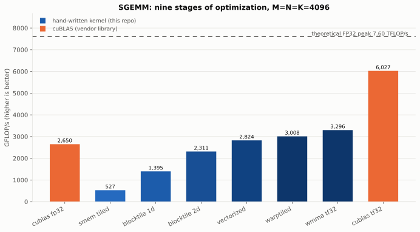
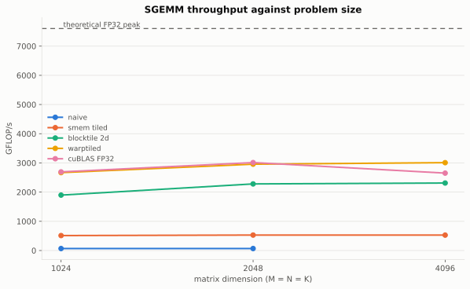
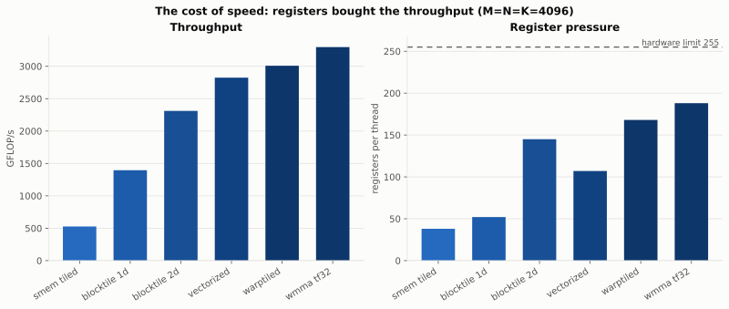
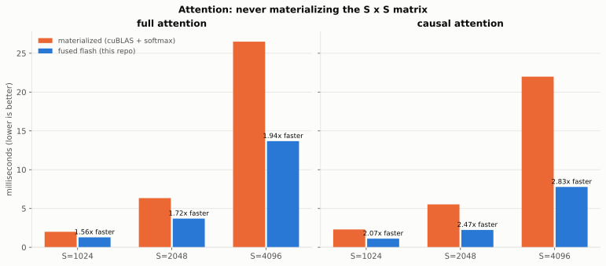
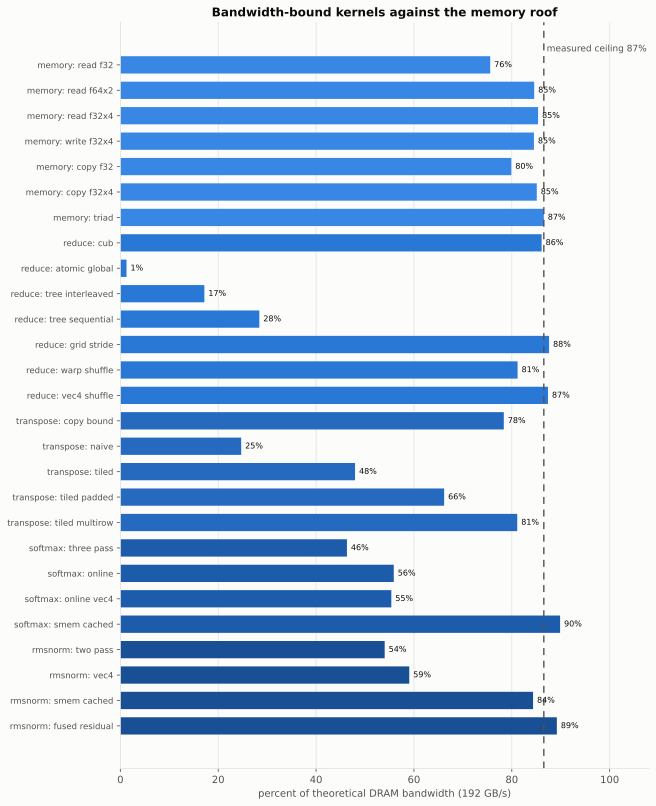
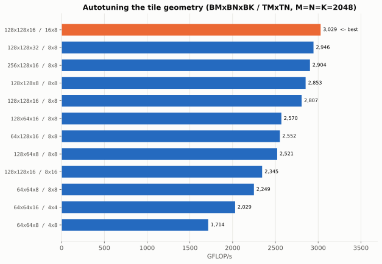
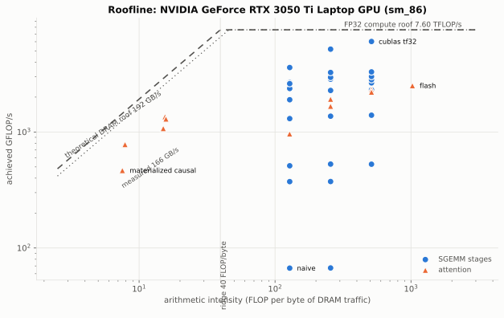

<div align="center">

# warpsmith

**A CUDA kernel optimization lab.** Thirty-four hand-written kernels across seven
suites, taken from the textbook version to cuBLAS-competitive — one optimization at
a time, with every step measured on real hardware.

[](https://github.com/NavyashreeNS/warpsmith/actions/workflows/ci.yml)
[](LICENSE)


[Results dashboard](https://navyashreens.github.io/warpsmith/) ·
[Full benchmark report](results/REPORT.md) ·
[Deep dive: how each optimization works](docs/deep-dive.md)

</div>

---

## The short version

A GPU is rarely slow because it lacks arithmetic units. It is slow because those
units are **waiting**. This repository takes the kernels that matter most in modern
machine learning — matrix multiply, reduction, transpose, softmax, RMSNorm,
attention — and rebuilds each one from the naive version upward, adding exactly one
optimization per stage so that the measured jump between two adjacent stages
isolates the value of that single technique.

Nothing here wraps a library. Every kernel is written from scratch in CUDA C++ and
then held against the strongest available yardstick: **cuBLAS** for GEMM, **CUB**
for reduction, a double-precision host implementation everywhere else. Correctness
is checked before speed is measured, and the benchmark exits non-zero if any kernel
returns a wrong answer.

<!-- BEGIN:HEADLINE -->

| Result | Measured |
| :--- | :--- |
| SGEMM, best hand-written FP32 kernel | **3,008 GFLOP/s at 4096x4096x4096 - 114% of cuBLAS FP32, 40% of the FP32 ceiling** |
| SGEMM, tensor-core kernel (WMMA, TF32) | **3,296 GFLOP/s - 124% of cuBLAS FP32, 22% of the TF32 tensor-core ceiling** |
| SGEMM, speedup from naive to fastest, same problem | **48x at 2048x2048x2048** |
| Reduction, best kernel | **168.3 GB/s (88% of theoretical bandwidth)** |
| Reduction, speedup over global atomics | **70x** |
| Transpose, best kernel | **155.8 GB/s (81% of theoretical bandwidth)** |
| Attention (full), fused vs materialized at S=4096 | **1.94x faster, 2.00 GiB less DRAM traffic** |
| Attention (causal), fused vs materialized at S=4096 | **2.83x faster, 2.00 GiB less DRAM traffic** |
| Total measurements | **79** |
| Correctness failures | **0** |

<!-- END:HEADLINE -->

<div align="center">

<picture>
  <source srcset="docs/charts/sgemm-progression-dark.svg" media="(prefers-color-scheme: dark)">
  
</picture>

*Nine implementations of the same matrix multiply. Same FLOPs, same answer, and the
distance between the first bar and the last is the entire subject of this repository.*

</div>

---

## Table of contents

- [What is in here](#what-is-in-here)
- [Results](#results)
  - [SGEMM: nine stages](#sgemm-nine-stages)
  - [Attention: fused vs materialized](#attention-fused-vs-materialized)
  - [The bandwidth-bound kernels](#the-bandwidth-bound-kernels)
  - [Autotuning the tile geometry](#autotuning-the-tile-geometry)
  - [Where every kernel sits on the roofline](#where-every-kernel-sits-on-the-roofline)
- [Quick start](#quick-start)
- [How the numbers are produced](#how-the-numbers-are-produced)
- [Repository layout](#repository-layout)
- [What is not here](#what-is-not-here)
- [References](#references)

---

## What is in here

| Suite | Kernels | The question it answers |
|:---|:---|:---|
| **SGEMM** | 8 hand-written + 2 cuBLAS baselines | How close can a from-scratch kernel get to the vendor library, and what does each optimization contribute? |
| **Attention** | 2 implementations × causal and non-causal | What does *not* materializing the S×S score matrix actually buy? |
| **Reduction** | 6 hand-written + CUB baseline | How do you saturate memory bandwidth, and why is the parallel algorithm also the more accurate one? |
| **Transpose** | 4 hand-written + a copy upper bound | Coalescing and shared-memory bank conflicts, isolated from all arithmetic. |
| **Softmax** | 4 hand-written | The online algorithm, and how far "read the input fewer times" gets you. |
| **RMSNorm** | 4 hand-written | The LLaMA-family normalization, including the residual fusion production code always does. |
| **Memory** | 7 microbenchmarks | What this GPU can *actually* sustain — the empirical roofline everything else is judged against. |

Techniques implemented, in the order the SGEMM progression introduces them:
global-memory coalescing · shared-memory tiling · 1D register tiling · 2D register
tiling with an outer-product inner loop · vectorized `float4` access · a transposed
shared-memory layout · warp-level tiling · tensor cores via WMMA in TF32 ·
compile-time autotuning over the tile geometry. Elsewhere: warp shuffles,
bank-conflict-free padding, grid-stride persistent kernels, online (single-pass)
softmax, kernel fusion, and FlashAttention-style streaming attention.

---

## Results

All measurements below are from `results/results.json`, produced by
`warpsmith_bench` on the machine described in the [report](results/REPORT.md). The
tables and charts in this repository are **generated from that file** by
`tools/report.py` and `tools/plot.py`; the tables below are injected into this
README by the same tool rather than typed. CI regenerates the report from the
committed results and fails if it differs, so a documented number cannot drift
from the measured one.

### SGEMM: nine stages

<!-- BEGIN:SGEMM -->

At `4096x4096x4096`. `01_naive` and `02_coalesced` are omitted at this size: they take minutes per launch, and their trend is already established at smaller sizes. The full sweep across every problem size, with timing distributions, occupancy and the naive stages, is in the [report](results/REPORT.md).

| stage | what it adds | GFLOP/s | % of cuBLAS | regs/thread | rel L2 error |
| :--- | :--- | ---: | ---: | ---: | ---: |
| `00_cublas_fp32` | vendor library baseline | 2,650 | 100% | - | 0.0e+00 |
| `03_smem_tiled` | stage 32x32 tiles in shared memory | 527 | 20% | 38 | 1.2e-06 |
| `04_blocktile_1d` | 8 accumulators per thread in registers | 1,395 | 53% | 52 | 1.2e-06 |
| `05_blocktile_2d` | 8x8 register tile, outer-product inner loop | 2,311 | 87% | 145 | 1.2e-06 |
| `06_vectorized` | float4 access and a transposed A tile | 2,824 | 107% | 107 | 1.2e-06 |
| `07_warptiled` | explicit warp-level tile between block and thread | 3,008 | 114% | 168 | 1.2e-06 |
| `08_wmma_tf32` | 16x16x8 MMA instructions on the tensor cores | 3,296 | 124% | 188 | 2.6e-04 |
| `09_cublas_tf32` | vendor library, tensor cores enabled | 6,027 | 227% | - | 2.6e-04 |

<!-- END:SGEMM -->

<div align="center">
<picture>
  <source srcset="docs/charts/sgemm-scaling-dark.svg" media="(prefers-color-scheme: dark)">
  
</picture>
</div>

The interesting part is not that the optimized kernel is fast. It is *why* it is
fast, and the cost:

<div align="center">
<picture>
  <source srcset="docs/charts/cost-of-speed-dark.svg" media="(prefers-color-scheme: dark)">
  
</picture>
</div>

Occupancy — the usual thing people are told to maximize — goes **down** across this
progression, because each thread claims more registers to hold more accumulators.
Throughput goes up anyway. What the SM needs is not more resident warps; it is
enough independent work in flight to hide latency, and 64 independent
multiply-adds per thread is a great deal of independent work.

### Attention: fused vs materialized

Both implementations perform the same `4·S²·D` multiply-adds and produce the same
answer. The materialized one writes the S×S score matrix to DRAM, reads it back for
the softmax, writes it again, and reads it a third time for the value projection.
The fused one never creates it.

<div align="center">
<picture>
  <source srcset="docs/charts/attention-dark.svg" media="(prefers-color-scheme: dark)">
  
</picture>
</div>

<!-- BEGIN:ATTENTION -->

At `S=4096`, 8 heads, head dimension 64.

| implementation | median | GFLOP/s | speedup | S x S scratch | rel L2 error |
| :--- | ---: | ---: | ---: | ---: | ---: |
| `00_materialized` | 26.499 ms | 1,297 | 1.00x | 64.00 MiB | 7.6e-07 |
| `01_flash` | 13.679 ms | 2,512 | 1.94x | 0 | 1.2e-06 |
| `02_materialized_causal` | 21.990 ms | 781 | 1.00x | 64.00 MiB | 3.3e-07 |
| `03_flash_causal` | 7.775 ms | 2,210 | 2.83x | 0 | 3.9e-07 |

<!-- END:ATTENTION -->

The trick that makes fusion possible is **online softmax**. Softmax appears to need
a global maximum before anything can be exponentiated, which is what forces the
score matrix into memory. Carrying a running maximum `m` and denominator `l`, and
correcting the accumulator by exactly `exp(m_old − m_new)` whenever a larger value
appears, removes the dependency — and the result is not an approximation, it is the
same number the two-pass algorithm produces.

Causal masking widens the gap further: the fused kernel skips entire key tiles
above the diagonal before issuing a single dot product, while the materialized
version must compute those scores and then throw them away.

### The bandwidth-bound kernels

Reduction, transpose, softmax and RMSNorm do so little arithmetic that the memory
system is the only thing that matters. For these, the honest yardstick is not
"faster than before" but "what fraction of the memory roof did you reach".

<div align="center">
<picture>
  <source srcset="docs/charts/bandwidth-dark.svg" media="(prefers-color-scheme: dark)">
  
</picture>
</div>

<!-- BEGIN:BANDWIDTH -->

The streaming microbenchmarks sustain **166 GB/s** on this device, 87% of the 192 GB/s theoretical figure - that is the real ceiling these kernels are chasing. A row may edge past it: the percentages are computed from each kernel's *algorithmic* traffic, so a kernel whose working set is partly served by L2 moves fewer bytes at DRAM than it logically reads.

| suite | best kernel | GB/s | % of theoretical peak | speedup over stage 1 |
| :--- | :--- | ---: | ---: | ---: |
| Reduction | `04_grid_stride` | 168.3 | 88% | 69.68x |
| Transpose | `04_tiled_multirow` | 155.8 | 81% | 3.28x |
| Softmax | `04_smem_cached` | 172.6 | 90% | 1.94x |
| RMSNorm | `03_smem_cached` | 162.0 | 84% | 1.56x |

<!-- END:BANDWIDTH -->

The reduction suite also produces a result that has nothing to do with speed.
Floating-point addition is not associative, so summation order changes the answer:
a serial accumulation of *n* terms accumulates error like `√n`, while a tree of
depth `log₂ n` accumulates it like `√(log n)`. Measured against a
Kahan-compensated double-precision sum, the tree reductions are roughly **three
orders of magnitude more accurate** than the atomic version. The parallel algorithm
is not only faster — it is more correct.

### Autotuning the tile geometry

The best tile shape is not a property of GEMM; it is a property of a particular
GPU's register file, shared memory and issue width. So the stage-6 kernel is a
template over its geometry, and the tuner instantiates the search space and
measures it — including deliberately over-subscribed configurations, because a
register spill is worth seeing rather than guessing at.

<div align="center">
<picture>
  <source srcset="docs/charts/autotune-dark.svg" media="(prefers-color-scheme: dark)">
  
</picture>
</div>

### Where every kernel sits on the roofline

Arithmetic intensity — FLOPs per byte of DRAM traffic — decides which ceiling
binds. Below the ridge point a kernel is starved by memory no matter how good its
arithmetic is; above it, the arithmetic units are the constraint.

<div align="center">
<picture>
  <source srcset="docs/charts/roofline-dark.svg" media="(prefers-color-scheme: dark)">
  
</picture>
</div>

This one plot explains the whole SGEMM progression. A GEMM *algorithm* has enormous
arithmetic intensity — `2N³` FLOPs over `3N²` bytes. A naive GEMM *implementation*
has almost none, because it re-reads the same data from DRAM `N` times. Stages 2
through 7 do not change the FLOP count at all; they recover the intensity the
algorithm always had.

---

## Quick start

**Requirements:** CUDA Toolkit 12.0+, CMake 3.24+, a C++17 host compiler, and an
NVIDIA GPU of compute capability 7.5 or newer. The tensor-core kernel additionally
needs 8.0+ (it compiles for older targets but reports rather than misleads). Python
3.9+ with `matplotlib` is needed only to regenerate the charts.

```bash
git clone https://github.com/NavyashreeNS/warpsmith
cd warpsmith

# Linux / macOS
./scripts/build.sh --test --bench

# Windows (PowerShell) - locates MSVC via vswhere, then drives CMake
.\scripts\build.ps1 -Test -Bench
```

Or drive CMake directly:

```bash
cmake -S . -B build -DCMAKE_BUILD_TYPE=Release
cmake --build build --parallel
ctest --test-dir build --output-on-failure
```

Then run whatever you want to look at:

```bash
build/warpsmith_bench --list                       # what suites exist
build/warpsmith_bench                              # everything, ~4 minutes
build/warpsmith_bench --suite sgemm                # one suite
build/warpsmith_bench --suite tune                 # the tile-geometry sweep
build/warpsmith_bench --quick                      # smaller problems, seconds
build/warpsmith_bench --json results/results.json  # machine-readable output
```

Regenerate the report and charts from a results file:

```bash
python tools/report.py   results/results.json --out results/REPORT.md
python tools/plot.py     results/results.json --outdir docs/charts
python tools/validate_results.py results/results.json
```

To profile a kernel rather than time it, the build embeds line information, so
Nsight Compute correlates counters straight back to the source:

```bash
ncu --set full --kernel-name-base demangled \
    -k regex:warptiled build/warpsmith_bench --suite sgemm --quick
```

---

## How the numbers are produced

Benchmarking a GPU kernel badly is easy, and a plausible-looking wrong number is
worse than no number. The harness in
[`include/warpsmith/bench.cuh`](include/warpsmith/bench.cuh) addresses each of the
usual failure modes:

- **CUDA events recorded on the stream**, so host-side launch overhead and driver
  scheduling jitter are excluded from the measurement.
- **Untimed warm-up launches** before the first sample, so SM and memory clocks
  have settled and the instruction cache is hot.
- **Many samples, median reported.** The p95 and the coefficient of variation are
  published in every table, because a measurement without a stability figure is an
  anecdote. The dispersion figures are computed over the middle 90% of samples:
  these kernels are timed on a desktop OS that preempts the GPU for compositing,
  and one such outlier in a hundred samples otherwise makes a rock-solid kernel
  report a triple-digit variance.
- **Correctness before speed.** Every kernel is validated against a trusted
  reference on the same inputs, with non-trivial `alpha`/`beta` so a kernel that
  silently ignores the epilogue cannot pass. Tolerances scale with `√K`, because
  that is how FP32 rounding actually accumulates in a K-term dot product — a fixed
  absolute tolerance would wrongly fail large problems.
- **Ceilings derived from the device**, via `cudaDeviceProp` clocks and core
  counts, not pasted from a spec sheet.
- **Static resource usage reported per kernel** — registers per thread, shared
  memory per block, occupancy from `cudaOccupancyMaxActiveBlocksPerMultiprocessor`
  — because those three numbers explain most surprises.

Two caveats stated plainly. `% of peak` uses the clock the driver reports, and a
laptop GPU boosts above it when cool and throttles well below it under sustained
load; the `cv` column is where that shows up. And the reference GPU here is a
4 GB laptop part, so absolute throughput is far below a datacenter card — the
*ratios* (percent of cuBLAS, percent of roofline, speedup between stages) are the
portable results, and they are what the tables emphasize.

---

## Repository layout

```
warpsmith/
├── include/warpsmith/
│   ├── bench.cuh              measurement harness: events, robust statistics, occupancy
│   ├── device.cuh             device introspection and derived roofline ceilings
│   ├── reduce_ops.cuh         warp and block reduction primitives
│   ├── sgemm.cuh              SGEMM variant registry
│   ├── sgemm_vectorized.cuh   the stage-6 kernel, templated over its tile geometry
│   ├── testing.cuh            deterministic inputs, error metrics, RAII device buffers
│   ├── suite.cuh              benchmark suite interface
│   └── json.hpp               dependency-free JSON writer
├── src/
│   ├── kernels/
│   │   ├── sgemm/             00_cublas … 08_wmma_tf32, one file per stage
│   │   ├── attention/         materialized and fused (FlashAttention-style)
│   │   ├── reduce/            six reduction formulations
│   │   ├── transpose/         coalescing and bank conflicts
│   │   ├── softmax/           three-pass, online, vectorized, SMEM-cached
│   │   ├── norm/              RMSNorm, including residual fusion
│   │   └── memory/            streaming bandwidth microbenchmarks
│   ├── bench/                 driver, console tables, JSON output
│   └── tests/                 correctness suite against cuBLAS
├── tools/
│   ├── report.py              results JSON → Markdown report
│   ├── plot.py                results JSON → SVG charts, light and dark
│   └── validate_results.py    schema and internal-consistency checks
├── docs/
│   ├── deep-dive.md           how and why each optimization works
│   ├── index.html             results dashboard (GitHub Pages)
│   └── charts/                generated SVGs
├── results/
│   ├── results.json           the committed reference measurement
│   └── REPORT.md              generated from it
└── scripts/                   build.sh, build.ps1
```

Every kernel file is self-contained and opens with a comment explaining what it
adds to the previous stage and why that matters — the source is meant to be read in
numbered order.

---

## What is not here

Being explicit about the boundaries is more useful than implying there are none.

- **The tensor-core kernel is the weakest result in the repository.** It reaches
  roughly a third of the TF32 ceiling and cuBLAS beats it comfortably in TF32 mode.
  It demonstrates the WMMA programming model correctly, but a competitive
  tensor-core GEMM needs software pipelining that it does not have: `cp.async`
  bulk copies into a multi-stage shared-memory buffer, `ldmatrix` for fragment
  loads, and a swizzled layout to keep fragment reads conflict-free. That is the
  top item on the list.
- **No FP16/BF16 path.** TF32 was chosen so the comparison against the FP32
  progression stays apples-to-apples. Half precision would roughly double the
  tensor-core ceiling again.
- **Stages 4 onward require aligned shapes.** They assume M, N and K are multiples
  of the tile dimensions. Ragged-edge handling costs a predicate on every load and
  would blur the measurement, so the alignment requirement is declared in the
  variant registry and the benchmark skips shapes it cannot handle rather than
  silently producing wrong answers. Production code would add a separate epilogue
  path.
- **Attention is forward-only, single-batch, `D = 64`.** No backward pass, no
  grouped-query attention, no KV cache, no paged attention.
- **CI cannot measure.** GitHub's hosted runners have no GPU, so CI verifies that
  every kernel still compiles for four architectures and that the committed report
  and charts match the committed results. The measurements must be reproduced
  locally.
- **Single GPU, no multi-GPU or NCCL.**

---

## References

The techniques here are not invented; they are implemented from the literature and
then measured. Worth reading in this order:

- Simon Boehm, [*How to Optimize a CUDA Matmul Kernel for cuBLAS-like
  Performance*](https://siboehm.com/articles/22/CUDA-MMM) — the clearest published
  walkthrough of the SGEMM progression, and the structure this repository's stages
  follow.
- Mark Harris, [*Optimizing Parallel Reduction in
  CUDA*](https://developer.download.nvidia.com/assets/cuda/files/reduction.pdf) —
  the original seven-step reduction study.
- Dao et al., [*FlashAttention: Fast and Memory-Efficient Exact Attention with
  IO-Awareness*](https://arxiv.org/abs/2205.14135), and Dao,
  [*FlashAttention-2*](https://arxiv.org/abs/2307.08691).
- Milakov & Gimelshein, [*Online normalizer calculation for
  softmax*](https://arxiv.org/abs/1805.02867) — the one-pass softmax that makes
  fused attention possible.
- Williams, Waterman & Patterson, [*Roofline: An Insightful Visual Performance
  Model*](https://dl.acm.org/doi/10.1145/1498765.1498785).
- NVIDIA, [*CUDA C++ Programming
  Guide*](https://docs.nvidia.com/cuda/cuda-c-programming-guide/) and the
  [*CUTLASS*](https://github.com/NVIDIA/cutlass) source, for the WMMA and
  warp-tiling details.

---

<div align="center">

**MIT licensed.** Built and measured by [Navyashree N S](https://github.com/NavyashreeNS).

</div>
